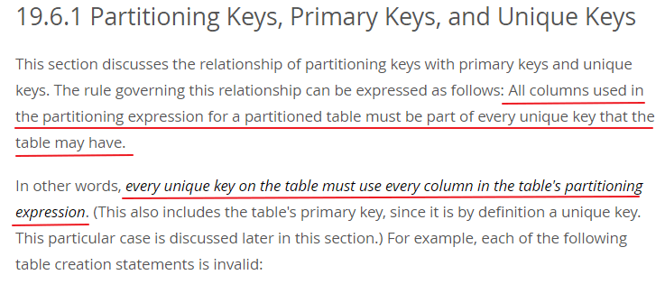

背景：最近负责考虑自己所在项目的数据库性能优化方案，主要是一张大表 **table_a**，预计上线以后会有亿级甚至十亿级数据，需要解决单表数据量过大所带来的性能和管理问题。

​	本文对常用数据库优化方法进行整理、分析和总结，最终给出了适合本项目的数据库优化方案。若要跳过各数据库优化方法的分析，直接看优化方案，**可直接跳到第3节**。

## 数据库常用优化方法分析

​	首先，介绍一下较为常用的数据库优化方案，并进行适用场景、优势劣势分析。

### 数据删除策略

#### 理论依据

​	参考原则：任何表的设计都要考虑到数据的删除策略，表中的数据不能无止境的增长而不删除。

### 1.2 优化SQL设计

​	包括SQL语句优化、游标、存储过程等

### 1.3 优化数据库对象设计

​	包括表、索引、分区设计等

### 1.4 缓存策略

#### 1.4.1 理论依据

​	缓存策略：对于高并发需要访问数据库的业务操作，可以考虑在业务和数据库之间增设高速缓存组件xxx，从而提高业务性能。

#### 1.4.2 适用性分析

​	项目中引入缓存一般是为了应对高频访问且不常修改的数据的查询，防止大量的请求进入数据库，导致其他数据操作的延迟。

### 1.5 读写分离

#### 1.5.1 理论依据

​	读写分离策略：

1）对于读多、写少访问特别频繁的表，可以考虑采取读写分离的架构，通过增加读库来提高业务读操作的能力。

2）如果业务需要构建读写分离能力，统一使用DRDS中间件这个标准方案

#### 1.5.2 适用性分析

- 读写分离原理： 将数据库分为主从库，一个主库用于写数据，多个从库完成读数据的操作，主从库之间通过某种机制进行数据的同步，是一种常见的数据库架构。

- 读写分离解决的问题：在读多写少的场景下，数据库的读会首先称为数据库的瓶颈。这时，如果我们希望能够线性的提升数据库的读性能，消除读写锁冲突从而提升数据库的写性能，那么就可以使用读写分离架构。读写分离分散了数据库读写的压力，但没有分散存储压力。

- 对时效性没有那么高的场景下，才可以使用读写分离，如：需要生成运营报表，可以用读写分离。对于业务相关的数据库操作，时效性要求比较高，都不要做读写分离

### 1.6 数据库水平切分：分区、水平库内分表、水平分库分表

​	数据库水平切分，可以分为分区、分库、分表，本节对这几种方式分别进行简要分析。

#### 1.6.1 理论依据：

​	分表分库策略

1）对于记录数超过2000w的大表，需要考虑物理分库、分表或者创建分区表，分区记录同样不超过2000w

2）业务数据量超过1亿，数据库文件>500G，并且随着时间的推移会持续增长，建议考虑使用分库分表的解决方案，使用分布式数据库中间件xxxx来实现。

#### 1.6.2 分区

##### 1.6.2.1 理论依据

​	对于超过1000万行的大表，要考虑建分区

​	分区的目的

1) 易于管理：随着数据量的递增，表和索引越来越难维护，增删改查的速度也会越来越慢，使用分区将表和索引分割成较小的单元，便于维护与管理。使用分区能够聚焦于特别的分区，比如按月分区表，只需要逻辑备份当前月的数据，因此可以使用partiton指定到本月而不用全表备份。在清理历史数据的时候，只需要针对历史分区采用truncate操作，极大的降低了管理的难度。

2) 提高性能：由于每个分区的数据量大大减少，因此在增删改查的时候，可以通过指定分区范围来提高检索的性能。在进行并行操作的时候，采用智能分区连接减少上下文的切换也可以极大的提高性能。

3) 提高可用性：某个分区出现问题不会影响正常分区的使用；通过指定不同的tablespace作物理分割，不但可以提高查询的性能，还能够避免热块竞争。

##### 1.6.2.2 适用性分析

​	分析：使用分区，需要考虑分区键约束。MySQL官方给出的分区键的约束条件如下：

​     **分区表达式中的所有列都必须是每个唯一键（包括主键）的一部分。**

换句话说：**表中的每一个唯一键（包括主键），都必须包含分区表达式中的所有列。**

                               

具体说明见MySQL官方文档：https://dev.mysql.com/doc/refman/5.6/en/partitioning-limitations-partitioning-keys-unique-keys.html

依据上述约束条件，若要使用分区，需要考虑以下几点：

- 表table_a必须存在主键

- 若要使用table_a的非主键字段进行分区，则要将其加入该表的主键和唯一索引字段，使得主键成为复合主键，唯一索引成为联合唯一索引。但一旦将其加入主键，使主键成为复合主键，则不满足第二范式：每一个非主键字段必须完全依赖于主键。

对分区键约束条件的理解： 若不遵循该约束条件，则mysql无法在各分区之间保证由主键索引和唯一索引要求的记录唯一性。

##### 1.6.2.3 优劣分析

- 优势：
  - 对代码侵入小
  - 若使用用户id字段分区，能够将记录按用户均匀分配到不同分区中，能提高查询性能
  - 若使用时间字段分区，有利于记录按时间段删除，避免delete语句带来的空间不释放问题（但如果使用了分库分表而不使用分区，磁盘空间碎片影响不大）
- 劣势：
  - 使用分区需要调整主键和唯一索引，要将分区键加入主键和唯一索引。
  - 如果使用用户id字段进行hash分区，扩展性较差
  - 如果使用时间字段分区，单分区内数据量较大，未解决单表数据量过大的问题
  - 分区表，如果需要调整表结构，如加字段，会比较慢
  - 关联查询的逻辑需要调整

#### 1.6.3 水平库内分表

##### 1.6.3.1优劣分析

- 优势：
  - 解决了单表数据量过大的问题
- 劣势：
  - 库内分表对应用业务逻辑侵入性较大
  - 只解决了单一表数据量过大的问题，但没有将表分布到不同机器的库上，因此对于减轻MySQL数据库的读写压力来说，帮助不是很大，大家还是竞争同一个物理机的CPU、内存、网络IO

#### 1.6.4 水平分库分表

##### 1.6.4.1 适用性分析

​	读写分离分散了数据库读写操作的压力，但没有分散存储的压力，当数据量达到千万甚至上亿条的时候，单台数据库服务器的存储能力会成为系统的瓶颈。单个数据库服务器存储的数据量不能太大，需要控制在一定的范围内。为了满足业务数据存储的需求，就需要将存储分散到多台数据库服务器上。

##### 1.6.4.2 优劣分析

​	水平分库分表策略的优劣分析如下：

- 优势：
  - 同时解决单表数据量过大和单服务IO性能不足的问题
  - 对业务代码侵入小
  - 水平扩展性好，可以实现不停服平滑扩容，不需要和分区同时实施
- 劣势：
  - 分库成本比较高，需要至少两套数据库服务器，目前云服务要求一套DB至少有4台机器（主备）
  - 分库可能带来以下问题：
  - 事务一致性问题
  - 跨节点关联查询 join 问题，关联查询逻辑需要调整
  - 跨节点分页、排序、函数问题
  - 全局主键避重问题
  - 数据迁移、扩容问题

 

## 2 数据库优化相关工具

​	业界常用开源数据库优化的工具有：

## 3 优惠券服务数据库性能优化方案

​	经过上述分析，结合当前服务特点，对于本服务的数据库性能优化，建议按以下方法进行：

a)    优化SQL设计

b)    优化索引设计

c)    使用数据删除策略

d)    使用分布式缓存

e)    实施水平分库分表

注意，本服务数据库性能优化方案，不建议使用分区，具体原因见本文[1.6.2.2节的适用性分析](#_1.6.2.2_适用性分析)和[1.6.2.3的优劣分析](#_1.6.2.3_优劣分析)。

下面介绍上述各步骤的具体实施方案。

### 3.1 优化SQL设计（开发时优化）

开发人员在编写SQL语句时，按规范要求优化SQL设计。

### 3.2 优化索引设计（开发时优化）

开发人员设计表索引时，按规范要求优化索引设计。

### 3.3 数据删除策略

使用定时任务，定期按照时间字段删除过期优惠券，避免table_a表中记录无限增长。

### 3.4 使用分布式缓存

识别热点数据和常用查询条件。

- 热点数据从缓存查询，若缓存中数据不存在，则从DB中查询；

- 非热点数据直接查DB。

更新热点数据时，先更新DB，再令缓存中数据失效。

### 3.5 实施水平分库分表

​	考虑数据量增长后的数据库扩展性，对于优惠券数据库，可以使用数据库中间件将数据量大的表实施水平分库分表。如对table_a表来说，可以使用用户id字段作为键来实施水平分库分表。

​	注意不要过早实施分库分表，避免"过度设计"和"过早优化"，但要尽早考虑分库分表的方案，以具备该能力。