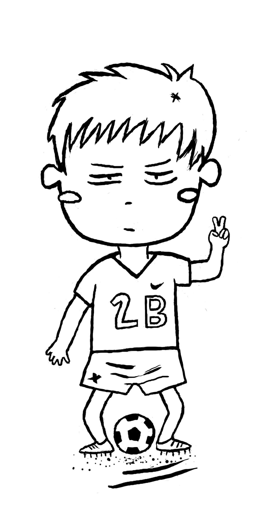

&emsp;&emsp;我是Aaron，毕业于WHU，软件工程硕士，现就职于HW。  
&emsp;&emsp;这是我的个人博客。我会整理一些知识、分享一些我在学习和工作中的经验心得和感悟等，希望在这个瞬息万变的互联网，能够有一个积累和沉淀自己的地方。  
&emsp;&emsp;我热爱coding，相信技术，相信技术能够改变世界。我有一点强迫症，有一点完美主义，但完美不意味着卓越，所以我在改变。我认为选择很重要，努力也很重要，所以不要轻易做出选择，但选择以后就必须义无反顾。
&emsp;&emsp;我的价值观：

* 遵纪守法。遵守任何所在地区的法律法规和道德约束。
* 积极进取。主动成为人生的第一次设计者。
* 拥抱变化。思维方式不僵化，主动去适应环境。
* 强身健体。身体是革命的本钱。通过饮食、作息、锻炼等去达到。
* 实事求是。尽量获取多方面的信息，以求客观地反映事物的真实情况。
* 不断更新。保持开放的心态，向任何值得学习的对象去学习，不断更新自己的知识储备，方法论等，站在巨人的肩膀上。
* 勇于创造。做任何事，可以参考但不囿于前人的经验。遇事经过自己的判断，敢于成为先吃螃蟹的人。
* 以原则为中心。原则是能够正确反映客观世界的真理，要能够辨别和学习原则，并遵守它们地去生活。

&emsp;&emsp;如果你有话想对我说，可以email我，页面右下角有我的邮箱链接。  
&emsp;&emsp;最后送给自己，也送给看到我博客的你：不劳无获，行胜于言；不忘初心，只争朝夕。

